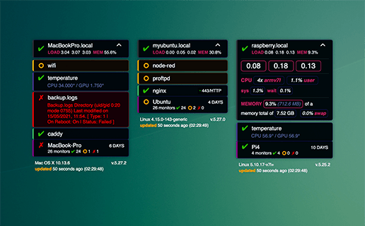

Übersicht | Monit Widget
=================
:closed_book: [Übersicht Homepage](http://tracesof.net/uebersicht/)
&nbsp;&nbsp;&nbsp;:pushpin: [Übersicht Widgets](http://tracesof.net/uebersicht-widgets/)
&nbsp;&nbsp;&nbsp;:page_facing_up: [Widgets GitHub Repo](https://github.com/felixhageloh/uebersicht-widgets)

The Widget displays the status of your services monitored with __[monit](https://mmonit.com/monit/)__ on your macOS desktop with [Übersicht](http://tracesof.net/uebersicht/).



## Configuration

With the json configuration file, you can manage the monit instances, but also define what is displayed, reorganize the services and change some styles of the widget.

| Name                 | Type               | Value                | Description                                          |
|----------------------|--------------------|----------------------|------------------------------------------------------|
| debug                | `bool`/`number`    | true/false 1 or 2    | output info to the console                           |
| refreshFrequency     | `number`           | ms                   | monit data fetch frequency                           |
| idle                 | `number`           | seconds              | seconds of inactivity after the widget stop fetching data |
| group                | `bool`             | true/false           | __experimental__: group instances (in array) and display each group alternatively. Caveat: This redraw all the widget each time. |
| instances            | `array`            | `instance`           | array of instance definition                         |
| showOk               | `bool` or `array`  | true/false or array  | `true` to show all ok services or an `array` of services names or types to show |
| showUnmonitoredInfos | `bool`/`number`    | true/false, 1, 2     | show unmonitored services infos, 1 or true for all, 2 for only essential services |
| forceColumn          | `bool`             | true/false           | force columns instead of rows when `showOk` is `false` |
| top                  | `string`           | css value            | top position of the widget                           |
| left                 | `string`           | css value            | left position of the widget                          |
| maxWidth             | `string`           | css value            | max width of each instance                           |
| maxHeight            | `string`           | css value            | max height of the widget                             |
| color1               | `string`           | css color            | color used in the header                             |
| color2               | `string`           | css color            | color used in the system stats                       |
| programOutputColor   | `string`           | css color            | color of the program service type output             |
| listBackgroundColor  | `string`           | css color            | default list item background color                   |
| listBorderColor      | `string`           | css color            | default list item border color                       |
| listInfosColor       | `string`           | css color            | default service infos color (shown on item click)    |
| listCompression      | `number`           | 0 to 6               | list vertical spacing                                |
| unmonitoredServices  | `object`           | -                    | unmonitored service styles definitions               |
| failedServices       | `object`           | -                    | failed service styles definitions                    |
| dimOk                | `bool` or `string` | `false` or css color | css color for ok services                            |
| ordered              | `bool`             | true/false           | reorder services, false to display as is             |
| coloredIndicator     | `bool`             | true/false           | show color indicator on left side of the service     |
| servicesOpts         | `object`           | service type         | config for each service type (see below)             |


__instance__

| Name        | Type      | Value | Description                          |
|-------------|-----------|-------|--------------------------------------|
| id          | `string`  | text  | instance name (used as id)           |
| url         | `string`  | url   | complete url to fetch the xml data   |
| user        | `string`  | text  | basic auth username                  |
| passwd      | `string`  | text  | basic auth password                  |
| insecure    | `bool`    | -     | accept insecure https connection     |
| noncritical | `array`   | -     | array of less critical services names shown in different style |
| showStats   | `bool`    | -     | auto display system stats            |
| enabled     | `bool`    | -     | `false` to disable this instance     |

 __servicesOpts__

| Name        | Type      | Value      | Description                                               |
|-------------|-----------|------------|-----------------------------------------------------------|
| key         | `object`  | -          | service type                                              |
| p           | `number`  | 0 to 7     | service order, use same number to keep the original order |
| c           | `string`  | css color  | service type indicator color                              |
| s           | `object`  | css styles | additional service type style                             |

## Exemple config

```json
{
    "debug": 0,
    "refreshFrequency": 60000,
    "idle": 300,
    "group": false,
    "instances": [
        {
            "id": "Ubuntu Server",
            "url": "https://monit.myubuntu.tld/_status?format=xml",
            "user": "ubuntu",
            "passwd": "*****",
            "insecure": false,
            "noncritical": ["ftpd"],
            "showStats": false
        },
        [
            {
                "id": "Server 01",
                "url": "https://myserver1.local/monit/_status?format=xml",
                "user": "",
                "passwd": "",
                "insecure": true,
                "noncritical": ["temperature", "nginx"],
            },
            {
                "id": "Server 02",
                "url": "https://myserver2.local/monit/_status?format=xml",
                "user": "",
                "passwd": "",
                "insecure": true,
            },
            {
                "id": "Server 03",
                "url": "https://myserver3.local/monit/_status?format=xml",
                "enabled": false
            },
        ],
        {
            "id": "Raspberry",
            "url": "https://monit.mypi.local/_status?format=xml",
            "user": "pi",
            "passwd": "****",
            "insecure": true
        }
    ],
    "showOk" : [7, "nginx", "temperature", "mysql"],
    "showUnmonitoredInfos": 2,
    "top": "30px",
    "left": "20px",
    "forceColumn": true,
    "maxWidth": "220px",
    "maxHeight": "90vh",
    "color1": "#b7275d",
    "color2": "#c22963",
    "programOutputColor": "#62679f",
    "listBackgroundColor": "rgba(0, 6, 10, 0.98)",
    "listBorderColor": "#1a1748",
    "listInfosColor": "#8e95ce",
    "listCompression": 5,

    "unmonitoredServices": {
        "default": {
            "style": {
                "borderColor": "#8a5c00 #8a5c00 #8a5c00 orange",
                "backgroundColor": "rgba(87, 38, 0, 0.98)"
            },
            "programOutputColor": "orange",
            "listInfosColor": "orange"
        },
        "noncritical": {
            "style": {
                "borderColor": "#4b3621 #4b3621 #4b3621 orange",
                "backgroundColor": "rgba(14,8,4,0.98)"
            },
            "programOutputColor": "orange",
            "listInfosColor": "orange"
        }
    },

    "failedServices": {
        "default": {
            "style": {
                "borderColor": "#560025 #560025 #560025 red",
                "backgroundColor": "rgba(20, 0, 5, 0.99)"
            },
            "programOutputColor": "red",
            "listInfosColor": "red"
        },
        "noncritical": {
            "style": {
                "borderLeftColor": "red",
                "backgroundColor": "rgba(20,0,0,0.98)"
            },
            "programOutputColor": "red",
            "listInfosColor": "red"
        }
    },

    "_dimOk": "#a4a4d6",
    "ordered": true,
    "coloredIndicator": true,
    "servicesOpts": {
        "5": { "p": 0, "c": "#2c2b36", "s": {"marginTop": "0", "marginBottom":"5px"}},
        "8": { "p": 1, "c": "#498152"},
        "0": { "p": 2, "c": "#88786d"},

        "1": { "p": 4, "c": "#3d4c50"},
        "2": { "p": 4, "c": "#3d4c50"},
        "3": { "p": 4, "c": "#4eb668"},
        "4": { "p": 4, "c": "#7169b9"},
        "6": { "p": 4, "c": "brown"},
        "7": { "p": 4, "c": "#453687"}
    }
}
```

## Infos

Show more info by clicking on a service list item, or open the monit instance page by clicking on the footer.

## Contribution

The widget is written with React. If you show something that can be improved, as it's the first time I use this framework, open an issue.

__Things that could be improved:__

* Toggle item visibility without refreshing all the widget via AppleScript.
* Groups: Update only what changed.